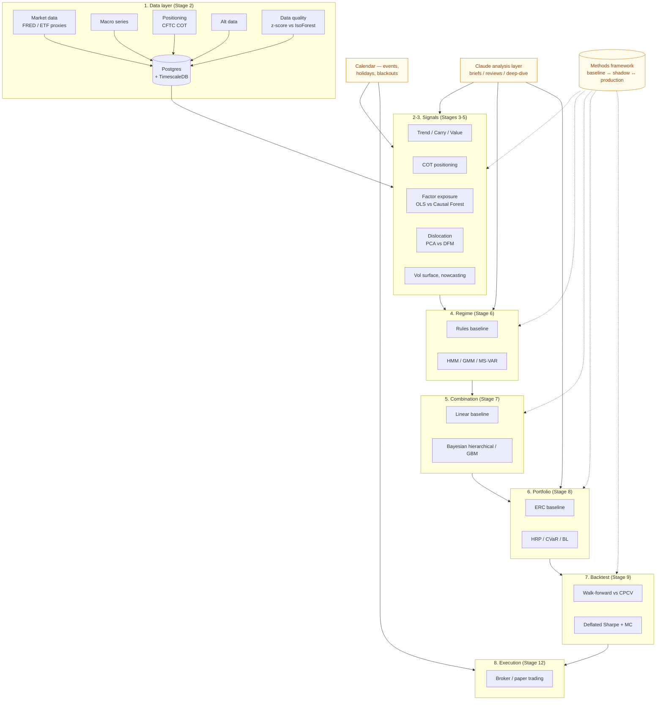

# Architecture

A systematic macro trading system organised as eight pipeline layers, with
three cross-cutting concerns: a **Claude analysis layer**, a **calendar**, and
the **methods comparison framework**. The methods framework is the most
important piece of Stage 1 — it is the contract every later stage uses to
introduce baseline vs enhancement algorithms.

## High-level diagram

## Layer responsibilities

1. **Data layer (Stage 2)** — point-in-time ingestion, schema enforcement, free
   data sources (FRED, ETF proxies of futures), TimescaleDB hypertables,
   data-quality methods.
2. **Signals (Stages 3–5)** — trend / carry / value; COT positioning; macro
   factor exposure; cross-asset dislocation; vol-surface; nowcasting; alt-data
   signals. Each signal exposes a baseline and, where useful, one or more
   enhancements registered through the methods framework.
3. **Regime classifier (Stage 6)** — rules baseline; HMM, GMM, MS-VAR,
   BOCPD enhancements.
4. **Signal combination (Stage 7)** — linear baseline; Bayesian-hierarchical
   and GBM enhancements.
5. **Portfolio construction and risk (Stage 8)** — covariance estimation,
   ERC baseline, HRP / CVaR / Black–Litterman enhancements.
6. **Backtester (Stage 9)** — walk-forward baseline; CPCV; deflated Sharpe;
   Monte Carlo; block bootstrap; stress scenarios.
7. **Claude analysis layer (Stage 10)** — daily brief, weekly review,
   per-position deep-dive, per-asset-class brief, monthly outlook; CB tone
   scoring; news entity extraction; event triggers.
8. **Execution (Stage 12)** — broker abstraction, paper-trading mode, order
   management, reconciliation.

## Cross-cutting

- **Calendar** — economic events, holidays, blackouts; informs signal masking
  and execution timing.
- **Reports + dashboard** — React frontend, FastAPI backend; seven dashboard
  views (Universe Scan, Trade Detail, Portfolio, Risk & Regime, Calendar, Alt
  Data, Reports/Claude) plus a Methods page surfacing the registry and
  comparison runs.
- **Methods framework** — registry + comparator + promotion gate. See
  `docs/methods_framework.md`.

## Infrastructure

- **Postgres 16 + TimescaleDB**, schema-per-domain (`market_data`,
  `positioning`, …, `auth`, `system`).
- **Dagster** for orchestration (assets, sensors, schedules).
- **FastAPI** for the dashboard backend; **JWT** auth with refresh-token
  rotation.
- **React + Vite + TanStack Query + Zustand + Tailwind + shadcn/ui** for the
  frontend; **Recharts**, **Plotly**, **TradingView Lightweight Charts** for
  visualisation.
- **uv** for Python dependency management; **pnpm** for the frontend.
- **structlog** for logging; JSON in production, pretty-console in dev.
