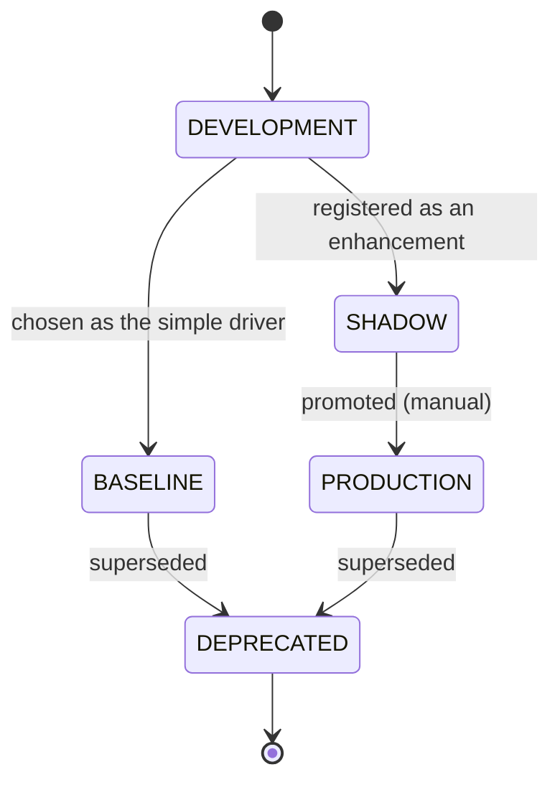

# Methods comparison framework

> This document is the contract every later stage must follow when it
> introduces an algorithm that can be swapped (baseline vs enhancement).
> Read it before writing any signal, regime classifier, portfolio
> constructor, or backtest variant.

## Why this exists

Every layer of the system needs algorithms — but research and production
have opposing pressures. Research wants newer, more powerful methods.
Production wants the simplest thing that works, with clear behaviour under
stress. The compromise that lets both proceed is **baseline + shadow**:

- The **baseline** is the simplest defensible implementation of a component
  (OLS, PCA, ERC, walk-forward). It runs in production and drives decisions.
- An **enhancement** is registered as a **shadow**: it runs on the same
  inputs but does NOT drive decisions. Its outputs are recorded and compared
  to the baseline on the same data window.
- Once the shadow has accumulated enough comparisons that *clearly* beat the
  baseline on a small set of pre-declared metrics, a human can promote it to
  **production**, demoting the baseline (or keeping it as a fallback).

Promotion is never automatic.

## Status lifecycle



Status semantics (`MethodStatus` enum):

- `development` — being built; not wired in.
- `baseline` — drives decisions by default. Per component, you typically
  have exactly one method in this state.
- `shadow` — runs in parallel; outputs recorded; never drives.
- `production` — promoted enhancement. At most one per component. When set,
  the registry auto-demotes the previously-driving method (baseline or older
  production) to `deprecated`.
- `deprecated` — retired but kept in the registry so historical comparison
  runs remain reproducible.

The registry enforces: **at most one `PRODUCTION` per component**. Promoting
a new method demotes the old one.

## Core abstractions

### `Method[InputT, OutputT]`

```python
from macro_trader.methods import Method, MethodMetadata

class MyMethod(Method[InputType, OutputType]):
    metadata = MethodMetadata(
        method_id="factor_exposure.ols.v1",   # stable globally-unique ID
        component="macro_factor_exposure",     # which layer / component
        name="OLS factor exposure",
        version="1.0.0",
        description="Rolling OLS on macro factor returns vs asset returns.",
        references=["docs/decisions/2026-05-factor-exposure.md"],
    )

    def fit(self, data): ...
    def predict(self, data): ...
    def serialize(self) -> bytes: ...

    @classmethod
    def deserialize(cls, blob: bytes) -> "MyMethod": ...
```

Required attributes / methods:

- `metadata: MethodMetadata` — stable identity and provenance.
- `fit(data)` — calibrate. May be a no-op for deterministic transforms.
- `predict(data)` — apply.
- `serialize()` / `deserialize()` — round-trip fitted state. Used by the
  registry to store models in `system.methods_registry.serialized_blob`.

### `MethodRegistry`

A process-level singleton mirrored to Postgres. Use the module-level
convenience functions for normal call sites:

```python
from macro_trader.methods import (
    register_method, get_method, list_methods,
    set_status, get_production, get_shadows,
)
from macro_trader.methods import MethodStatus

# At Dagster asset / job init time:
register_method(OLSExposure(), MethodStatus.BASELINE, session=session,
                reason="initial Stage 4 register")
register_method(CausalForestExposure(), MethodStatus.SHADOW, session=session,
                reason="enhancement for factor exposure")

# At runtime:
driver = get_production("macro_factor_exposure")      # returns the BASELINE or PRODUCTION
candidates = get_shadows("macro_factor_exposure")     # [Causal Forest, ...]
```

Every state change (status transition) writes a row to
`system.method_status_history` with `old_status`, `new_status`, and a
reason string. The history is immutable.

### `MethodComparator[InputT, OutputT]`

Per-component subclass that runs both methods on the same inputs and
produces a `ComparisonResult`.

```python
class FactorExposureComparator(MethodComparator):
    def __init__(self):
        super().__init__(component="macro_factor_exposure")

    def _compute_metrics(self, output_a, output_b, *, data):
        # Component-specific metrics. Convention: <metric>_a is baseline,
        # <metric>_b is shadow; deltas can be additional keys.
        return {
            "sharpe_a": sharpe_from(output_a),
            "sharpe_b": sharpe_from(output_b),
            "max_dd_a": max_dd(output_a),
            "max_dd_b": max_dd(output_b),
            "stability_a": stability(output_a),
            "stability_b": stability(output_b),
        }
```

`compare()` runs both methods, fills `metrics`, plus generic `agreement`
(correlation / rank correlation / exact-match-rate where applicable) and
`stability` (perturbation drift). Results persist to
`system.method_comparisons` and are exposed via `/api/v1/methods/comparisons`.

### `PromotionCriteria` + `evaluate_promotion`

```python
criteria = PromotionCriteria(
    component="macro_factor_exposure",
    min_shadow_period_days=180,
    min_comparison_runs=12,
    required_improvements=["sharpe", "max_dd_ratio", "stability"],
    improvement_threshold=0.05,    # 5% better relative
)
eligible, evidence = evaluate_promotion("factor_exposure.causal_forest.v1",
                                        criteria, session=session)
```

`evaluate_promotion` is **read-only**. It returns:

- `eligible: bool` — meets every criterion.
- `evidence: dict` — per-check pass/fail with numbers, suitable for
  rendering in the Methods page or putting in a PR description.

To actually promote, an operator (a) reviews the evidence in the dashboard,
(b) calls `POST /api/v1/methods/{id}/status` with admin auth, or invokes
the CLI equivalent.

## Comparison protocol

A typical comparison cadence:

```mermaid
flowchart LR
    A[Daily Dagster asset:<br/>FactorExposureComparator] --> B[Run baseline + shadow<br/>on yesterday's universe]
    B --> C[Persist ComparisonResult]
    C --> D[Dashboard Methods page<br/>shows latest deltas]
    D --> E{Eligible for<br/>promotion?}
    E -- no --> A
    E -- yes --> F[Operator reviews evidence]
    F --> G[POST /methods/{id}/status<br/>= production]
    G --> H[Registry demotes old prod]
```

Conventions every comparator should follow:

1. **Identical inputs.** Both methods see the exact same input slice. No
   leakage; no separate refits.
2. **Disjoint periods over time.** Aggregate metrics across many
   non-overlapping comparison windows; one comparison is not evidence.
3. **Pre-declared metrics.** The metric keys in
   `PromotionCriteria.required_improvements` MUST be present in every
   `ComparisonResult.metrics`. Adding metrics later does not affect history.
4. **No silent rerun.** If you find a bug in a method or comparator, bump
   the `version` field and create a new `method_id`. Do not edit the old
   one; do not delete its history.

## Database tables

`system.methods_registry` — one row per method.
`system.method_status_history` — append-only status-change log.
`system.method_comparisons` — one row per comparator run.

Schemas in `src/macro_trader/db/models/system.py`; migration `0001`.

## API surface

| Method | Path | Purpose |
| --- | --- | --- |
| GET | `/api/v1/methods` | list (filter by `component`, `status`) |
| GET | `/api/v1/methods/{id}` | detail |
| GET | `/api/v1/methods/{id}/history` | status transitions |
| GET | `/api/v1/methods/comparisons` | list (filter) |
| GET | `/api/v1/methods/comparisons/{id}` | comparison detail |
| POST | `/api/v1/methods/{id}/status` | admin-only status change |

## Worked example (Stage 4, factor exposure)

1. Build `OLSExposure(Method)` — `method_id="factor_exposure.ols.v1"`.
   Register as `BASELINE`.
2. Build `CausalForestExposure(Method)` — `method_id="factor_exposure.cf.v1"`.
   Register as `SHADOW`.
3. Subclass `MethodComparator` → `FactorExposureComparator` with sensible
   per-component metrics.
4. Wire a Dagster asset `factor_exposure_comparison` that runs the
   comparator daily on the prior window and persists the `ComparisonResult`.
5. After 180+ days and 12+ runs with the shadow consistently improving
   Sharpe and stability above 5%, call `evaluate_promotion`. If eligible,
   render evidence in the dashboard. An admin then POSTs
   `/methods/factor_exposure.cf.v1/status` with `status=production` and a
   reason. The registry demotes `factor_exposure.ols.v1` to `deprecated`.

## Things this framework does NOT do (deliberately)

- It does NOT decide what metric matters — components do.
- It does NOT auto-promote — humans always do.
- It does NOT enforce model-quality thresholds at registration time —
  promotion gate is the only enforcement point.
- It does NOT version data, only methods. Stage 9 (backtester) covers data
  point-in-time integrity.

## Where to look next

- Code: `src/macro_trader/methods/`.
- DB models: `src/macro_trader/db/models/system.py`.
- API: `api/routers/methods.py`.
- Tests: `tests/unit/test_methods_framework.py`,
  `tests/integration/test_methods_registry.py`.
- Stage-2 notes will register the first real methods (data quality:
  z-score baseline vs Isolation Forest enhancement).
