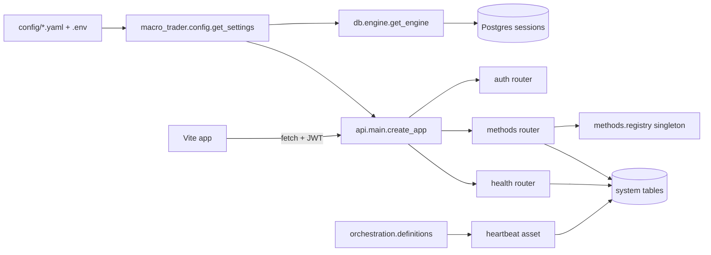

# Stage 1 — what was built and how it fits

This is the practical "where do I find X?" doc for Stage 1's deliverables.
The higher-level system architecture is in
[`../../docs/architecture.md`](../../docs/architecture.md). The methods
framework gets its own deep doc in
[`../../docs/methods_framework.md`](../../docs/methods_framework.md).

## File-by-file map of what's in this stage

### Methods framework — `src/macro_trader/methods/`

| File | Role | Public surface |
| --- | --- | --- |
| `status.py` | `MethodStatus` StrEnum | DEVELOPMENT, BASELINE, SHADOW, PRODUCTION, DEPRECATED |
| `base.py` | `Method[InputT, OutputT]` ABC + `MethodMetadata` dataclass | fit / predict / serialize / deserialize |
| `registry.py` | `MethodRegistry` class + module singleton | `register_method`, `get_method`, `list_methods`, `set_status`, `get_production`, `get_shadows` |
| `comparator.py` | `MethodComparator` ABC + `ComparisonResult` dataclass | `compare()` |
| `metrics.py` | Generic agreement + stability helpers | `output_agreement`, `output_stability` |
| `promotion.py` | `PromotionCriteria` + `evaluate_promotion` | gate eval, read-only |

The `__init__.py` re-exports the public surface so call sites just do
`from macro_trader.methods import Method, MethodStatus, register_method`.

### DB — `src/macro_trader/db/`

- `base.py` — `Base(DeclarativeBase)` with a stable naming convention.
- `engine.py` — lazy `get_engine`, `get_sessionmaker`,
  `@contextmanager get_session`.
- `schemas.py` — `DOMAIN_SCHEMAS` tuple.
- `models/system.py` — `MethodRegistryRow`, `MethodStatusHistoryRow`,
  `MethodComparisonRow`, `HeartbeatRow`.
- `models/auth.py` — `User`, `RefreshTokenRow`, `UserRole`.

### Config — `src/macro_trader/config.py`

`get_settings()` returns the merged Pydantic `Settings`. Layer order:

1. `config/base.yaml`
2. `config/<env>.yaml` (env from `APP_ENV`, default `dev`)
3. Environment variables / `.env` (parsed in `_env_overrides()`)

Subsections: `database`, `api`, `auth`, `dagster`, `frontend`,
`claude_api`, `logging`, `data_sources`, `methods`.

### Logging — `src/macro_trader/logging_setup.py`

`configure_logging()` is idempotent; `get_logger()` lazily configures on
first call. JSON in prod, pretty console in dev. Standard fields:
`timestamp`, `level`, `logger`, `event`, plus per-request `request_id` /
`path` / `method` bound by the FastAPI middleware.

### API — `api/`

- `main.py` — `create_app()` wires CORS, the request-context middleware,
  and the three routers (`health`, `auth`, `methods`).
- `deps.py` — `SessionDep`, `SettingsDep`, `CurrentUserDep`, `AdminDep`.
- `auth/jwt.py` — bcrypt hashing, JWT issue/decode, refresh-token creation.
- `auth/models.py` — Pydantic request/response shapes.
- `auth/routes.py` — `/register`, `/login`, `/refresh`, `/me`.
- `routers/health.py` — `/health` reports DB, TimescaleDB, heartbeat,
  methods framework status.
- `routers/methods.py` — methods registry CRUD + comparison reads + admin
  status change.

### Orchestration — `orchestration/`

- `definitions.py` — Dagster `Definitions`: heartbeat asset, job, schedule
  (every 5 min), resources (settings, methods registry).
- `assets/heartbeat.py` — writes one row to `system.heartbeat` per tick.

### Frontend — `frontend/`

- `vite.config.ts` + `tsconfig*.json` + `tailwind.config.ts` +
  `postcss.config.js` — tooling.
- `src/main.tsx` — bootstraps `App`.
- `src/App.tsx` — `BrowserRouter`, `QueryClientProvider`, routes (`/`,
  `/login`, `/methods` protected).
- `src/api/client.ts` — fetch wrapper with JWT, typed domain calls.
- `src/stores/auth.ts` — Zustand store with persistence.
- `src/pages/Home.tsx` — service health card + link to methods page.
- `src/pages/Login.tsx` — email/password form.
- `src/pages/Methods.tsx` — table grouped by component.
- `src/components/ui/*` — Button, Card, Input, Label, Badge, Table.

### Tests — `tests/`

- `conftest.py` — `test_settings`, `pg_engine` (creates test DB + runs
  alembic), `db_session` (transactional rollback per test),
  `_fresh_in_memory_registry` (auto-clears module singleton between tests).
- `tests/unit/test_config.py` — 6 tests for the layered config loader.
- `tests/unit/test_methods_framework.py` — 18 tests covering registry,
  status transitions, comparator, metrics, promotion-criteria validation.
- `tests/integration/test_db.py` — 4 tests for schema + extension + tables.
- `tests/integration/test_methods_registry.py` — 5 tests covering DB
  persistence, history, comparator results, promotion gate.

## Key interfaces for future stages

### Adding a method

```python
from macro_trader.methods import Method, MethodMetadata, MethodStatus, register_method

class MyBaseline(Method[InputT, OutputT]):
    metadata = MethodMetadata(
        method_id="<component>.<algo>.v<version>",
        component="<component_name>",   # must match the comparator's component
        name="...",
        version="1.0.0",
        description="...",
        references=[...],
    )
    def fit(self, data): ...
    def predict(self, data): ...
    def serialize(self): ...
    @classmethod
    def deserialize(cls, blob): ...

register_method(MyBaseline(), MethodStatus.BASELINE,
                session=session, reason="stage N — first baseline")
```

### Adding a comparator

```python
from macro_trader.methods import MethodComparator

class MyComparator(MethodComparator[InputT, OutputT]):
    def __init__(self):
        super().__init__(component="<component_name>")

    def _compute_metrics(self, output_a, output_b, *, data) -> dict[str, float]:
        return {"sharpe_a": ..., "sharpe_b": ..., "stability_a": ..., "stability_b": ...}
```

### Adding a DB model

1. Create the SQLAlchemy class in `src/macro_trader/db/models/<domain>.py`
   with `__table_args__ = {"schema": "<domain>"}`.
2. Import it from `src/macro_trader/db/models/__init__.py` so Alembic sees
   it.
3. Generate a migration: `uv run alembic revision --autogenerate -m "..."`.
4. Review and commit the migration file.

### Adding a config section

1. Add a Pydantic class to `src/macro_trader/config.py`.
2. Add a default block to `config/base.yaml`.
3. (Optional) override in `dev.yaml` / `test.yaml` / `prod.yaml`.
4. (Optional) wire env overrides in `_env_overrides()`.
5. Add a test to `tests/unit/test_config.py`.

### Adding an API route

1. Create or extend a router under `api/routers/`.
2. Use the `SessionDep`, `SettingsDep`, `CurrentUserDep`, `AdminDep`
   dependency aliases from `api/deps.py`.
3. Include the router in `api/main.py:create_app()` under `API_PREFIX`.

### Adding a Dagster asset

1. Create it under `orchestration/assets/`.
2. Re-export from `orchestration/assets/__init__.py`.
3. Add to `defs = Definitions(...)` in `orchestration/definitions.py` and
   wire a schedule or sensor if it should run automatically.

## Connectivity diagram (Stage 1 only)


