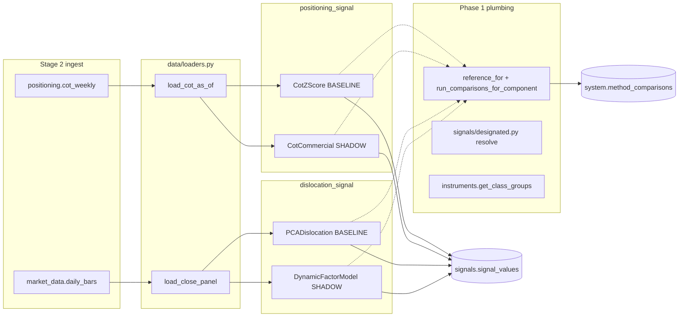

# Stage 4A — architecture

Practical "where do I find X?" map for the work shipped in this stage.

## What changed at the framework level

### Methods framework

- **`MethodRegistry.reference_for(component)`** — resolves
  `PRODUCTION -> BASELINE -> first-non-DEPRECATED` and returns
  `Method | None`. Module-level convenience: `get_reference_method(component)`.
  Distinct from the existing `production_for` which raises on miss.

- **`run_comparisons_for_component(component, comparator, data, *,
  period_start, period_end, session=None, notes="")`** in
  `macro_trader.methods.comparator`. Pulls the reference + every SHADOW
  from the registry, runs the comparator against each shadow, persists
  the `ComparisonResult` rows. Returns the list (empty if no
  reference or no shadows). The Stage-3 trend / value runners were
  reworked to call this in place of hardcoded baseline/shadow pairs.

- **`ComparisonResult.to_db_row()`** now sanitises NaN / inf -> None
  via `_sanitize_nans` so Postgres JSONB accepts the
  metrics/agreement/stability blobs.

### Config + designated-method resolution

- **`SignalsSettings`** added to `macro_trader.config` with an
  `extra=ignore` model_config so the existing decorative YAML keys
  under `signals.*` don't break validation. Carries
  `designated_per_component: dict[str, str]`.

- **`macro_trader/signals/designated.py`**:
  - `resolve(component) -> Method | None`
  - `resolve_id(component) -> str | None`
  - Order: config override -> registry PRODUCTION -> BASELINE
    -> first-non-DEPRECATED.

- **`api/routers/signals.py`** dropped the hardcoded
  `DESIGNATED_PER_COMPONENT` dict. `COMPONENTS_FOR_HEATMAP` (a
  tuple) drives which components the heatmap queries; the
  designated method per component is resolved at request time.

### Instrument-master grouping

- **`data/instruments.py:get_class_groups(session, instrument_ids,
  *, column="asset_class")`** returns
  `{label: [instrument_id, ...]}`. Accepts `asset_class` or
  `sub_class`. Drops unknown ids; raises on unknown columns.
- `CrossSectionalValue` now reads `class_column` (default
  `asset_class`) from its constructor and queries
  `get_class_groups` at compute time instead of the deleted
  `DEFAULT_SUB_CLASS_GROUPS` dict.

## New signal families

### Positioning (`positioning_signal`)

```
src/macro_trader/signals/positioning/
├── __init__.py
├── methods.py        # CotZScore (BASELINE), CotCommercial (SHADOW)
├── comparator.py     # PositioningSignalComparator
├── runner.py         # run_daily_positioning
└── register.py
```

- **`load_cot_as_of(session, instrument_id, *, as_of, report_type,
  lookback_weeks)`** in `data/loaders.py`. Filters
  `publication_ts <= as_of` so we only see reports that had actually
  been published by the as-of date (CFTC Tuesday report data is only
  "known" after Friday publication).
- Method shape: `(long - short) / open_interest -> rolling 156-week
  z-score -> -tanh(clip(-3, 3))`. Sign inversion: positive `raw_value`
  = long bias (crowd net short -> contrarian long).
- Stored `zscore` field is `arctanh(raw_value)` so consumers can
  recover the underlying z-score (modulo clip).
- Confidence: `min(1.0, history_weeks / lookback_weeks)`. A new
  instrument with 30 weeks of COT data gets `confidence=0.19`.
- Metadata fields per row: `report_type`, `is_extreme` (|raw|>=
  `tanh(2)`), `is_fresh_data` (publication advanced this run),
  `history_weeks`, `publication_ts`.

### Dislocation (`dislocation_signal`)

```
src/macro_trader/signals/dislocation/
├── __init__.py
├── methods.py        # PCADislocation (BASELINE), DynamicFactorModel (SHADOW)
├── comparator.py     # DislocationSignalComparator
├── runner.py         # run_daily_dislocation
└── register.py
```

- PCA: rolling 252-day return panel; top-3 factors; residual to
  reconstruction; `-tanh(clip(-3, 3))`. Re-fits on every
  `compute()` call.
- DFM: `statsmodels.tsa.statespace.DynamicFactor` with
  `k_factors=3, factor_order=1`. Convergence failures are caught
  and the method returns `[]` (logged), so the pipeline gracefully
  degrades to "PCA only this run".
- Both methods' `compute()` returns `[]` cleanly when:
  - the panel is empty or has fewer than 2 instruments,
  - the return panel has fewer than `min_history_days` rows,
  - after dropping NaN-only columns, fewer than `n_components+1`
    instruments remain.
- Confidence per row is bounded by the fit's explained variance,
  so weak factor structure downweights the signal.

## Database

No new tables this stage. `signals.signal_values` carries
positioning + dislocation outputs through `metadata` JSON for
family-specific fields. `system.methods_registry.serialized_blob`
remains unused (Stage 4A re-fits on every run — see tradeoffs).

## API surface

| Method | Path | Purpose |
| --- | --- | --- |
| GET | `/api/v1/signals/heatmap` | Now returns 5 components (positioning + dislocation added). |
| GET | `/api/v1/signals/positioning/cot` | Per-instrument COT breakdown over time (managed money / commercials / nonreportable longs+shorts+nets), filtered to vintages visible at `as_of`. |
| GET | `/api/v1/signals/dislocation/factors` | Latest per-instrument dislocation snapshot for a chosen method (`dislocation.pca.v1` or `dislocation.dfm.v1`). |

The heatmap, `/signals`, and `/signals/values` endpoints automatically
include the new components because they iterate
`COMPONENTS_FOR_HEATMAP` (a tuple in `api/routers/signals.py`).

## Dagster

| Asset | Group | Depends on |
| --- | --- | --- |
| `signal_positioning` | `signals_positioning` | `ingest_cftc_cot`, `daily_data_quality` |
| `signal_dislocation` | `signals_dislocation` | `ingest_yfinance_bars`, `daily_data_quality` |

Both added to `compute_all_signals_job` (23:30 UTC daily).
`signal_dislocation`'s daily cadence absorbs the ~30-60s DFM fit
cost; a separate weekly refit asset is deferred (see tradeoffs).

## Frontend

- `frontend/src/pages/Signals.tsx`'s `COMPONENT_ORDER` extended to
  five entries (`positioning_signal` / `dislocation_signal` added).
- Dedicated `/signals/positioning` and `/signals/dislocation` pages
  are not yet built; the heatmap + detail tabs accommodate the new
  columns automatically. Stage 4A-frontend follow-up tracked in
  `next.md`.

## Tests added this stage

| File | Count |
| --- | --- |
| `tests/unit/data/ingestion/test_{fred,yfinance,cftc,eia,usda,noaa,google_trends}.py` | 35 |
| `tests/unit/signals/positioning/test_methods.py` | 12 |
| `tests/unit/signals/positioning/test_comparator.py` | 4 |
| `tests/integration/signals/test_positioning_pipeline.py` | 1 |
| `tests/unit/signals/dislocation/test_pca.py` | 6 |
| `tests/unit/signals/dislocation/test_comparator.py` | 2 |
| `tests/unit/test_methods_framework.py` (additions) | 8 |
| `tests/integration/data/test_instruments.py` | 6 |
| **Total Stage 4A** | **74** |

Test totals overall: 168 passing in ~17s.

## Mermaid: Stage 4A connectivity


