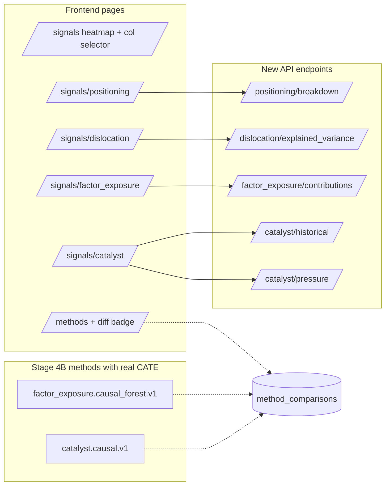

# Stage 4C — architecture

What was added, file-by-file.

## Phase 1 — frontend pages + column control + 5 API endpoints

**Frontend additions:**

```
frontend/src/
├── App.tsx                              # 4 new routes under /signals/<family>
├── api/client.ts                        # 9 new typed shapes + 9 new methods
├── pages/
│   ├── Signals.tsx                      # column-selection control on heatmap
│   ├── SignalsPositioning.tsx           # NEW (Phase 1.1)
│   ├── SignalsDislocation.tsx           # NEW (Phase 1.2)
│   ├── SignalsFactorExposure.tsx        # NEW (Phase 1.3)
│   └── SignalsCatalyst.tsx              # NEW (Phase 1.4)
├── stores/signalsView.ts                # NEW Zustand store + ALL_COMPONENTS
└── test/
    ├── SignalsPositioning.test.tsx      # NEW Vitest smoke
    ├── SignalsDislocation.test.tsx      # NEW
    ├── SignalsFactorExposure.test.tsx   # NEW
    └── SignalsCatalyst.test.tsx         # NEW
```

**Backend API additions** (all in `api/routers/signals.py`):

| Path | Purpose |
| --- | --- |
| `GET /signals/positioning/breakdown` | COT breakdown joined with signal values for an (instrument, method) pair. |
| `GET /signals/dislocation/explained_variance` | Time series of `metadata.explained_variance` per method (PCA steps weekly, DFM smooth). |
| `GET /signals/factor_exposure/contributions` | Per-factor `-loading × z_today` for an (instrument, method). |
| `GET /signals/catalyst/historical` | Per-event historical returns for an (instrument, optional subject) over the lookback. |
| `GET /signals/catalyst/pressure` | Per-instrument forward catalyst pressure sorted by `|score|`. |

## Phase 2 — backfill fixture, real CATE, shadow-differentiation badge

**Backfill infrastructure:**

```
tests/integration/fixtures/
├── __init__.py
└── backfill.py                # session-scoped fixture + regenerate CLI
tests/integration/conftest.py  # re-exports backfill_panel fixture
tests/data/                    # parquet cache lives here (.gitignored by default)
```

**Real CATE — factor exposure CF (`signals/factor_exposure/methods.py`):**

- Stage 4B's `est.fit(Y, T, W)` was incomplete; Stage 4C adds the
  required `X=W` argument so EconML actually computes the CATE.
- The CausalForest now produces per-(instrument, factor) CATE
  values in `_state["per_instrument"][inst]["cates"]` instead of
  silently returning `None`.

**Real CATE — catalyst (`signals/catalyst/methods.py`):**

- `CausalCatalyst` no longer wraps `EventStudyCatalyst`. It now
  fits one `CausalForestDML` per (instrument, event_subject) pair
  with ≥15 events, using stratified non-event days for the T=0
  control sample and macro factor z-scores at event time as the
  controls / heterogeneity features.
- Pairs with 5-14 events fall back to event-study sensitivity
  (tagged `fallback=True` in state); pairs with <5 are dropped
  per `min_events_for_estimate`.
- Output metadata gains `fallback_pairs: int` and the Stage 4B
  `placeholder_for_cate=True` flag is removed.

**Frontend — shadow differentiation indicator:**

- `frontend/src/pages/Methods.tsx` gains `ShadowDifferentiationBadge`.
- `frontend/src/api/client.ts` adds the `ComparisonRow` shape and
  switches `signalComparisons` to return `ComparisonRow[]`.

## Pytest markers

Added `real_data` marker in `pyproject.toml`:

```toml
markers = [
    "unit", "integration", "e2e", "slow",
    "real_data: real-data backfill tests (require tests/data/backfill_504d.parquet; skipped if missing)",
]
```

Run with `pytest -m real_data` once the cache is generated.

## Test surface after Stage 4C

| Suite | Count | Notes |
| --- | --- | --- |
| backend pytest (default) | 232 | up from 225 + 3 skipped — EconML installed |
| backend pytest (`-m real_data`) | 0 | infra exists; tests written in Stage 5 once cache lands |
| frontend Vitest | 4 new | smoke tests for the 4 new pages |

## Dependency state

- `pyproject.toml` `[project.optional-dependencies].ml = ["econml>=0.15.0"]`
- `uv.lock` regenerated to include EconML + transitive deps
  (numba, llvmlite, shap, sparse + sklearn pinned to 1.6.1 for
  EconML compat).

## Mermaid: Stage 4C connectivity


