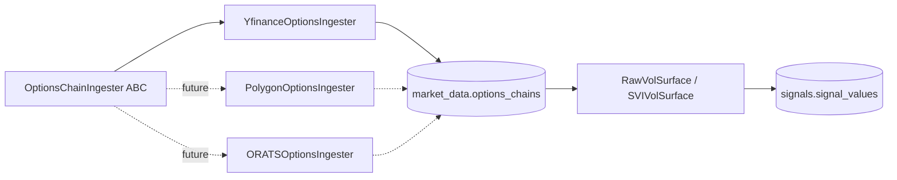

# Stage 5 — architecture

Three new signal families bring the stack to 10 total. File-by-file
additions below.

## Phase 1 — vol surface

```
alembic/versions/
└── 0004_options_chains_and_surfaces.py    # NEW migration

src/macro_trader/db/models/
└── market_data.py                          # +OptionsChain, +OptionsSurface

src/macro_trader/signals/vol_surface/
├── __init__.py
├── pricing.py             # Black-Scholes + Greek calcs (pure functions)
├── svi.py                 # Per-slice spline fitter + arb check
├── methods.py             # RawVolSurface (BASELINE), SVIVolSurface (SHADOW)
├── comparator.py          # VolSurfaceSignalComparator
├── runner.py              # Daily run
├── register.py
└── ingestion/             # Source-agnostic options-chain ingestion
    ├── __init__.py
    ├── base.py            # OptionsChainIngester abstract base + ChainRow
    └── yfinance.py        # YfinanceOptionsIngester
```

## Phase 2 — nowcasting

```
src/macro_trader/signals/nowcasting/
├── __init__.py
├── releases.py            # 6 ReleaseSpec entries (NFP, CPI, ISM_MFG, etc.)
├── bvar.py                # Normal-Inverse-Gamma conjugate posterior
├── methods.py             # OLSARNowcaster + BVARNowcaster
├── comparator.py
├── refit.py               # Weekly refit (Sunday 03:00 UTC)
├── runner.py
└── register.py
```

## Phase 3 — alt data

```
src/macro_trader/signals/alt_data/
├── __init__.py
├── methods.py             # EIAStorageSurprise + USDAWASDESurprise + GoogleTrendsSentiment
├── runner.py
└── register.py
```

## Cross-cutting after Stage 5

- `methods/setup.py` `register_all_methods` list now extends to 10
  components: trend, carry, value, positioning, dislocation,
  factor_exposure, catalyst, alt_data, nowcasting, vol_surface.
- `orchestration/assets/signals.py` `SIGNAL_ASSETS` list of 14
  Dagster assets (10 daily signal assets + 4 refit assets for
  dislocation / factor_exposure / catalyst / nowcasting).
- `orchestration/definitions.py` `compute_all_signals_job` includes
  all 10 daily signal assets. New `nowcasting_refit_job` +
  schedule `nowcasting_refit_weekly_sunday_0300_utc`.
- `config/base.yaml` `signals` block grew with `vol_surface`,
  `nowcasting`, `alt_data` sub-blocks +
  `designated_per_component` mappings for all 10 components.
- `api/routers/signals.py` `COMPONENTS_FOR_HEATMAP` extended to 10
  entries.
- `frontend/src/stores/signalsView.ts` `ALL_COMPONENTS` extended
  to 10 entries (the Stage 4C column-selection control handles
  the new density automatically).

## Schedule cadence after Stage 5

```
Daily:    23:30 UTC  compute_all_signals_job (all 10 families)
Weekly:   00:00 UTC  dislocation_models_refit       (Sunday)
          01:00 UTC  factor_exposure_models_refit   (Sunday)
          02:00 UTC  catalyst_models_refit          (Sunday)
          03:00 UTC  nowcasting_models_refit        (Sunday)
```

(Vol-surface methods are stateless — no refit asset. Alt-data
methods are stateless transforms of already-ingested data — no
refit asset.)

## Source-agnostic options-ingestion pattern



The post-v1 swap to a paid source is **one new file** in
`signals/vol_surface/ingestion/` plus a `data_source` config
change. No schema or runner changes.

## Final signal-stack view (10 families)

```mermaid
flowchart TB
    subgraph DATA[Stage 2 data]
        bars[market_data.daily_bars]
        macro[macro_data.series_observations]
        cot[positioning.cot_weekly]
        cal[macro_data.calendar_events]
        eia[alt_data.eia_inventory]
        usda[alt_data.usda_reports]
        gt[alt_data.google_trends]
        oc[market_data.options_chains]
    end
    subgraph SIG[10 signal families]
        s1[trend]
        s2[carry]
        s3[value]
        s4[positioning]
        s5[dislocation]
        s6[factor_exposure]
        s7[catalyst]
        s8[alt_data]
        s9[nowcasting]
        s10[vol_surface]
    end
    subgraph OUT[(signals.signal_values)]
        sv[hypertable on value_ts]
    end
    bars --> s1 & s2 & s3 & s5 & s6 & s10
    macro --> s6 & s9
    cot --> s4
    cal --> s7 & s9
    eia --> s8
    usda --> s8
    gt --> s8
    oc --> s10
    s1 & s2 & s3 & s4 & s5 & s6 & s7 & s8 & s9 & s10 --> sv
```
